## 这里是对平时遇到的一些性能问题的总结

1. 强缓存协商缓

2. 本地存储 localstorage, indexdb, sessionstorage, 比如表格替换, 进行缓存数据, 跳转回来不用在了请求, 减少了http请求

3. 使用cdn 缓存图片, 使用webp获取压缩后的图片，节省加载时间

4. 代码方面, react, 将功能拆分, 并且每个功能块, shouldupdate控制更新, 提供的api开关,使用批量更新, 差异更新, 减少和后台交互的字段, 较少数据量, 减少循环的嵌套, 使用高阶组件避免冗余

5. http请求这里使用dns预解析

6. 就是避免重排重绘, 比如获取宽度, js中设置样式

7. 避免内存泄漏

8. 移动端使用ssr优化首屏渲染速度

9. 防止重复请求, 截流防抖

10. 使用transfrom:translate实现移动, 避免使用定位, 因为定位会重复触发浏览器布局和之后的绘制的过程,而transfrom:translate直接跳过了, 布局和绘制, 直接执行了绘制之后的合成过程, 这样减小了浏览器的开销,优化了性能

在nginx 中开启 gzip压缩， gzip: on

11. service work 就是离线缓存， 在用户没有网的时候也可以用原来的数据进行操作界面

性能优化，先说性能优化指标， 然后再说使用什么手段优化哪个指标

视频 几十M就可以了, 在大就大了

图片200k左右算差不多, 还可以再小, 在大就大了

说一些性能优化的处理方案

说到性能优化, 我感觉主要是针对一些性能指标
1. first paint (FP), 第一次绘制像素的时间
2. 比如 （FCP）first contentful paint 网站上第一个有意义的内容绘制的时间,
3. 或者 （LCP）largest contentful paint 页面上最大的有意义的内容的绘制时间（就是从开始请求页面到页面上最大的有意义的内容展示的时间）,
4. （TTI）time to interactive (页面可以进行交互的时间， 就是从页面开始请求到页面可以交互的时间)，这些应该都属于首屏渲染的指标我感觉，首屏渲染的渲染的优化方案

1. 在nginx 开启 gzip压缩，减小请求资源的大小，解决加载时间，减少首屏加载的时间
2. 前端资源构建的时候进行压缩和去掉多余代码，比如webpack的terserplugin和tree-shaking，减小加载的资源
3. 使用按需加载, import函数动态加载， react中可以使用react.lazy和react.suspense实现按需加载，提高首屏渲染时间
4. 还有就是使用服务端渲染的方式，减少首屏渲染时间， 因为对这个比较感兴趣， 所以之前我自己搭建了一套服务端渲染的网站，从部署 + 发布 + 服务端 + 前端 跑通了整个流程，(目的就是想弄清楚服务端渲染ssr的整个实现过程，还有前后端代码发布和部署的实现)这里还需要准备自己的项目和看服务端渲染相关的面试题
5. 将图片资源放在CDN， 加速图片的请求（1.cdn通过负载均衡，根据用户所处的位置就近响应用户需要的资源，2.cdn会设置缓存，再次请求时速度很快3.cdn实现了跨运营商的网络加速，让不同网络的用户都可以实现加速）， 还有就是比如通过阿里云进行图片裁剪或者webp实现图片压缩, 加速图片请求, webp是谷歌推出的，现在 除了谷歌浏览器其他浏览器还有兼容问题, jpg和jpeg图片小，画质不高， png 图片画质高，图片大，
webp 图片小， 画质还高


还有一些优化从请求速度进行优化， 比如：
开启强缓存协商缓存， 当资源内容没有变化的时候直接使用缓存，提高获取资源的速度

还有一些优化是从渲染方面进行优化

防止重排重绘, 比如通过使用transform: translate 替代定位， 因为transform 只会触发图层合并， 不会出发重排和重绘， 节省时间

因为css 解析会影响render tree的形成， 所以尽早下载css， 完成css 解析

发生重排（reflow）的情况有，
1. 浏览器的窗口大小发生改变
2. 获取元素的宽高， 比如clientHeight和clientWidth获取元素宽高, 因为为了保证获取数据的正确性所以才发生重排
2. 改变dom结构， 删除和增加dom元素， 文字也属于dom元素
4. 设置display: none 隐藏元素， 会发生重排
5. 还有改变元素的宽高，也会引起重排
6. 元素的位置发生变化也会引起重排
7. 字体大小变化也会引起重排


发生重绘的情况
1. 不修改dom结构和位置， 比如修改字体颜色, 背景颜色， 这都会发生重绘


代码优化

避免使用大量的闭包， 避免引起内存泄露

展示优化 ： 使用图片懒加载，预加载

### 图片相关优化

1. jpeg压缩是有损压缩, 但是会做到肉眼无法识别, 所以jpeg比png小, jpeg就是jpg, jpg不支持透明

2. png 图片氛围三种, png压缩是无损的, 就是在三种格式中降级选择

png8 图片从个256颜色中获取色值绘制 png图片, 支持透明

png24 图片从个2^24颜色中获取色值绘制 png图片, 不支持透明

png32 图片从个2^32颜色中获取色值绘制 png图片, 支持透明

颜色越少图片越小, png8格式是最小的

3. webp 格式图片, 压缩程度更好, 可以将图片压缩的更小, 但是在ios 浏览器和webview中有兼容性问题, 安卓和chrome支持良好

4. svg 矢量图, 和普通图片相比, 就是不管放大还是缩小, 都不会失真, 不会出现马赛克, svg也是图片的一种格式


图片优化的方式

1. 将多个图片集合到一个图片中, 创建一个雪碧图, 然后调整位置展示不同图片
2. 将小的图片转成base64格式, 直接保存在html中, 不进行http请求, 减少不必要的请求


## 浏览器控制台总结
### 浏览器性能调试总结

### 控制台简介


### performance全局对象

```
在js中通过performance全局对象获取，当前网页的相关性能数据
```

### element 相关的总结

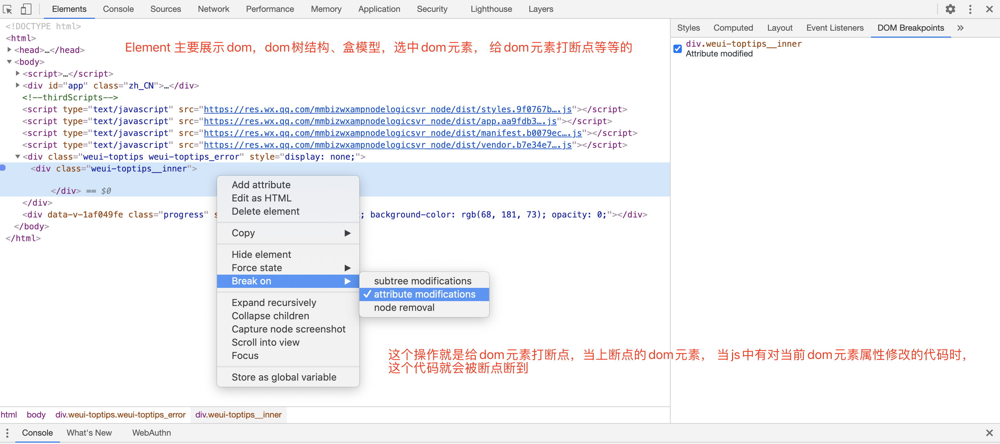

### memory 相关的总结

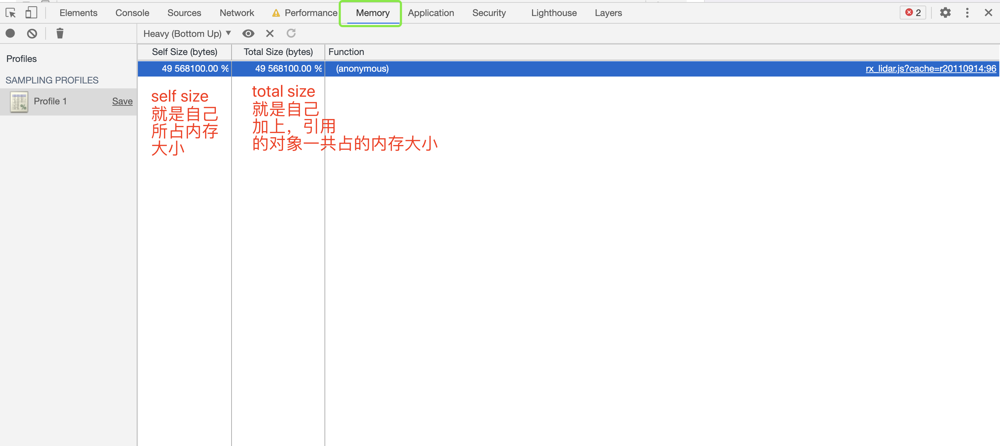

### network 相关的总结

1.


2.


3.


4.

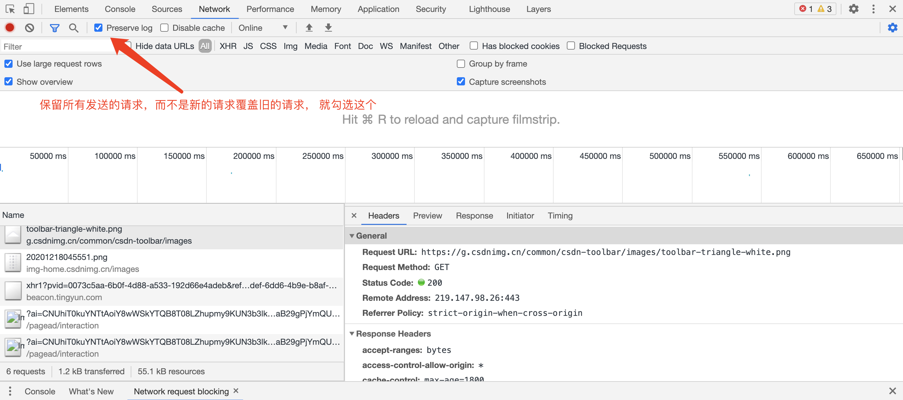

5.


6.


7.


8.


9.

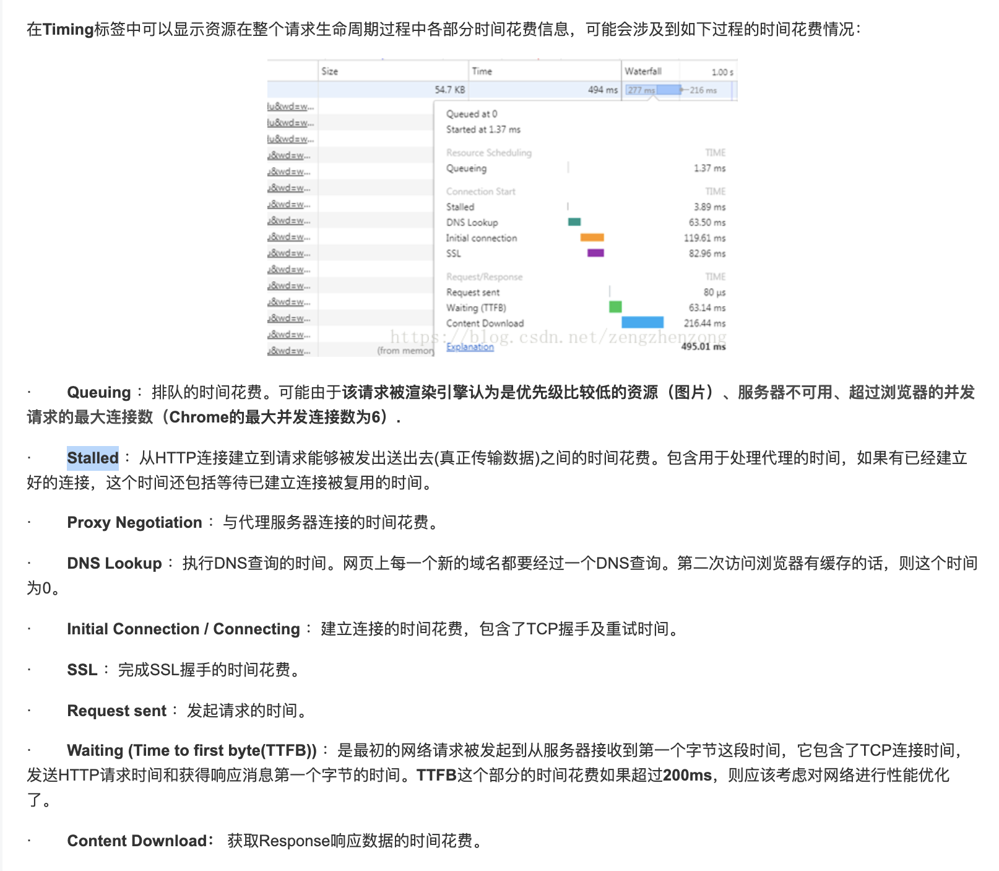

10.


### 使用Lighthouse 进行网页性能检测

一. 第一种使用lighthouse方式
```
npm install -g lighthouse 全局安装

lighthouse 网址地址

这样就可以进入网站检测网站了， 但是这样还需要自己加一些参数
```

二. 第二种方式
```
chrome 开发者工具提供的Lighthouse 核心模块
```
1. 使用Lighthouse检测页面性能， performance， 还有其他检测选项， 查看结果和performance相同


### 使用layers 查看页面的图层


### 使用performance 查看页面的图层

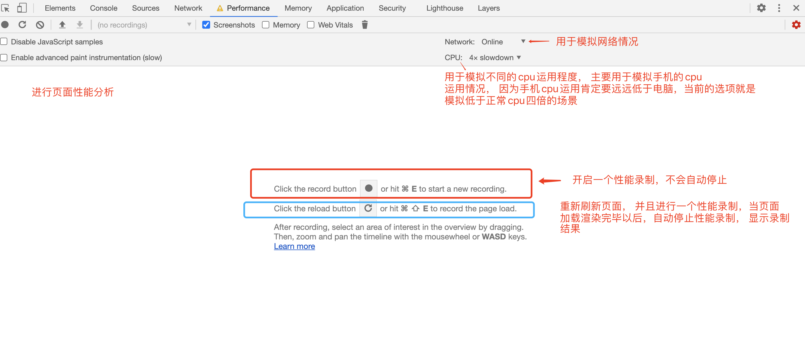

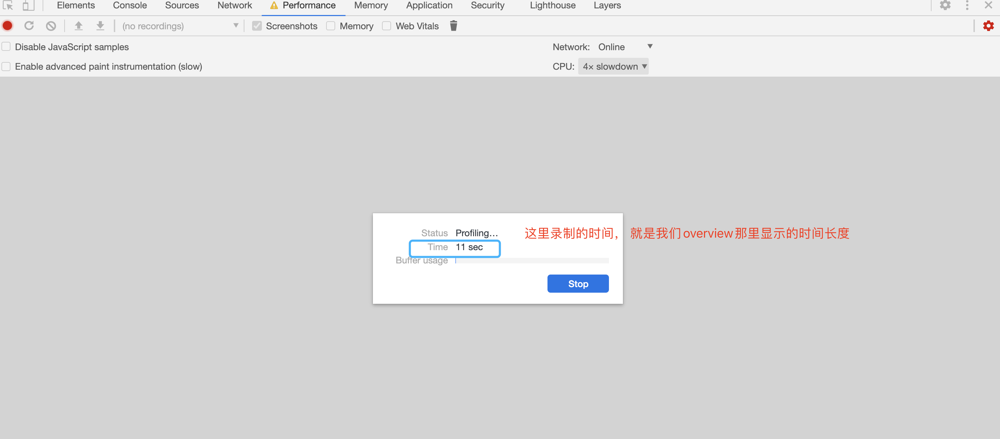

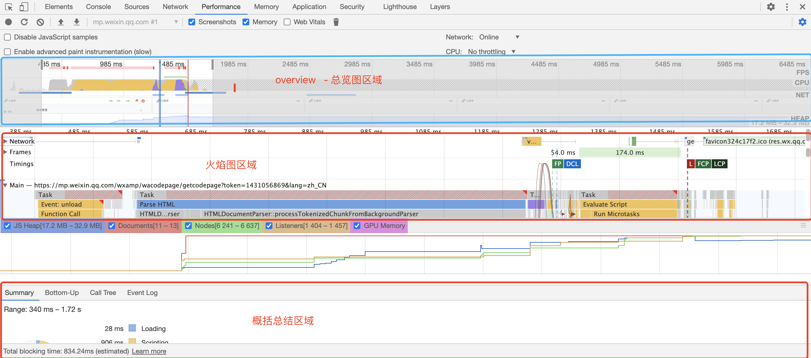

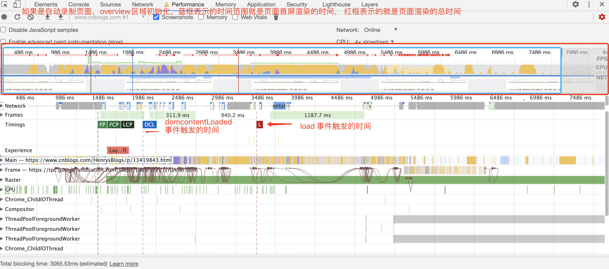

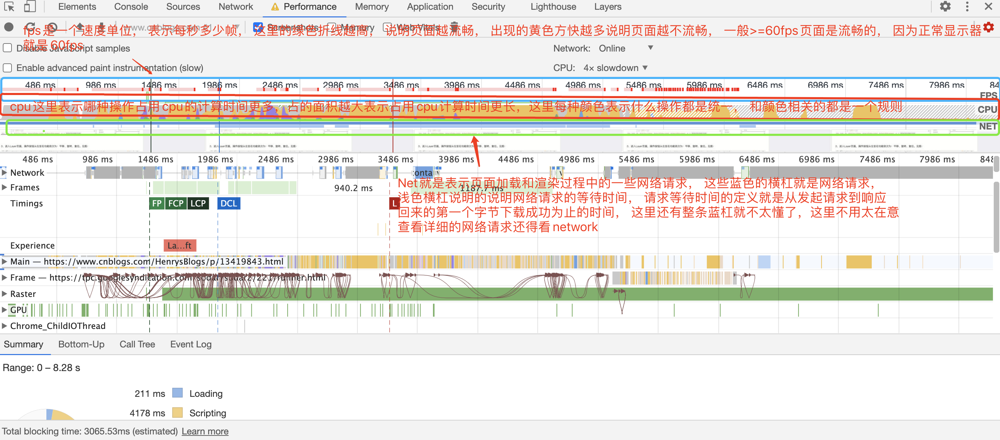


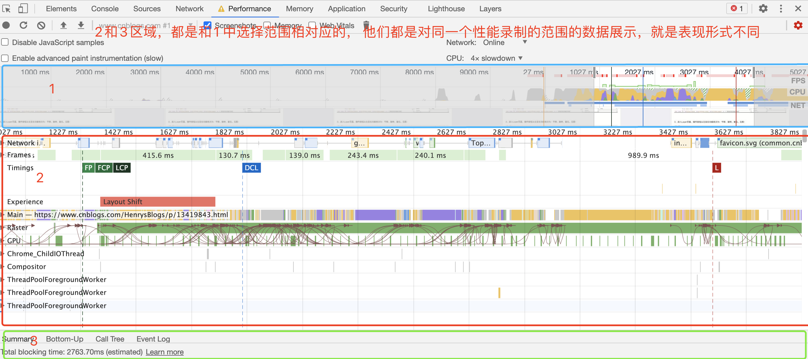

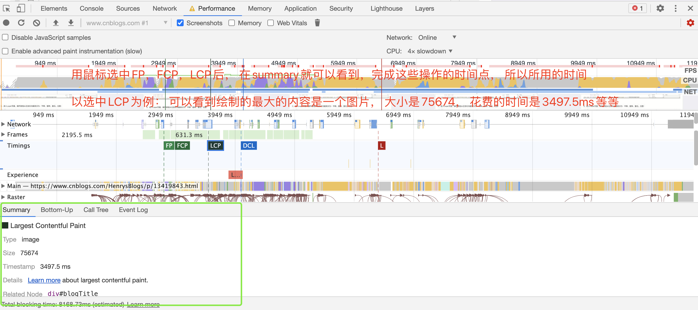

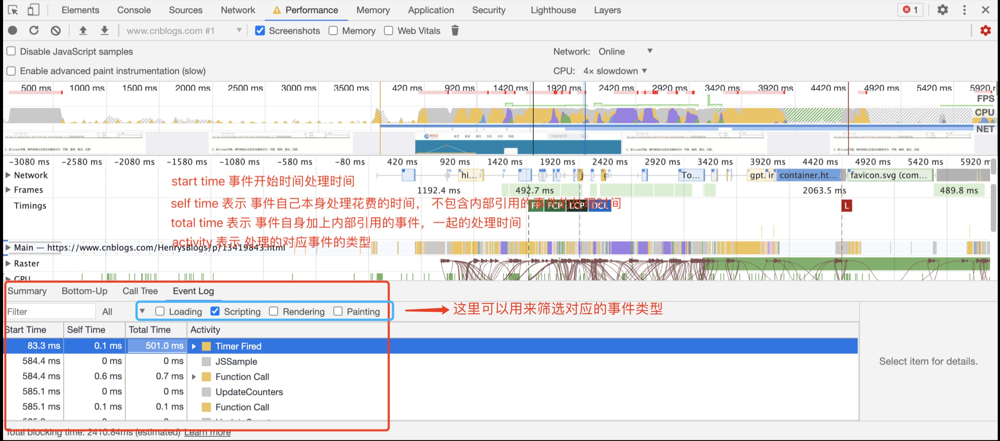

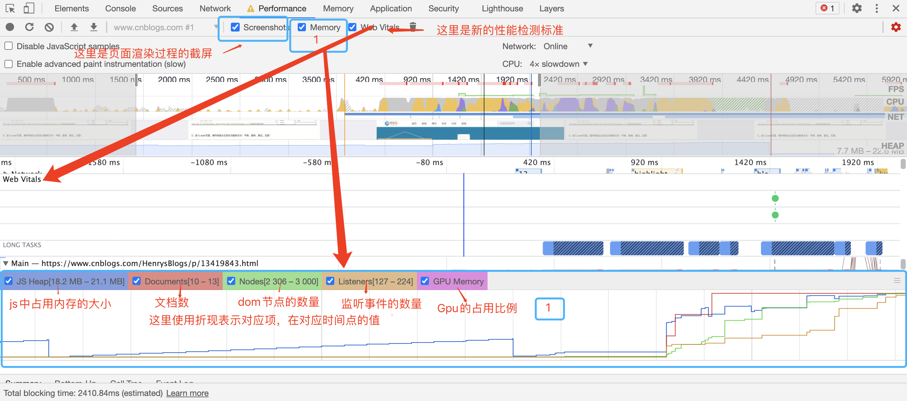

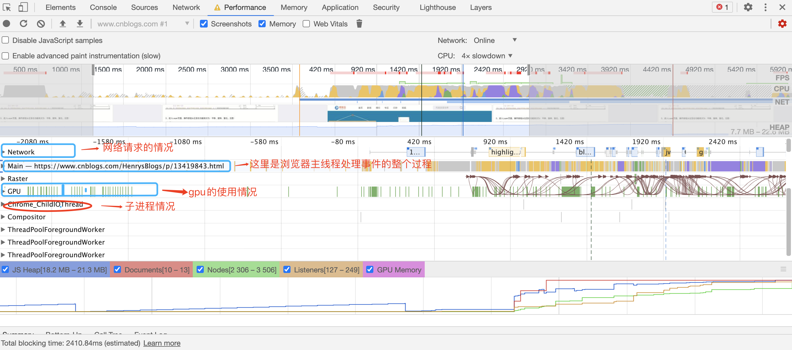

