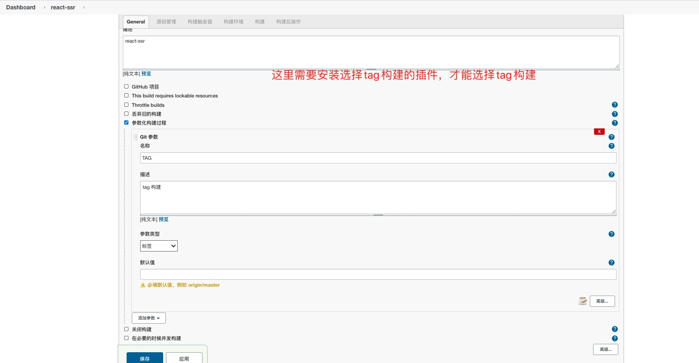
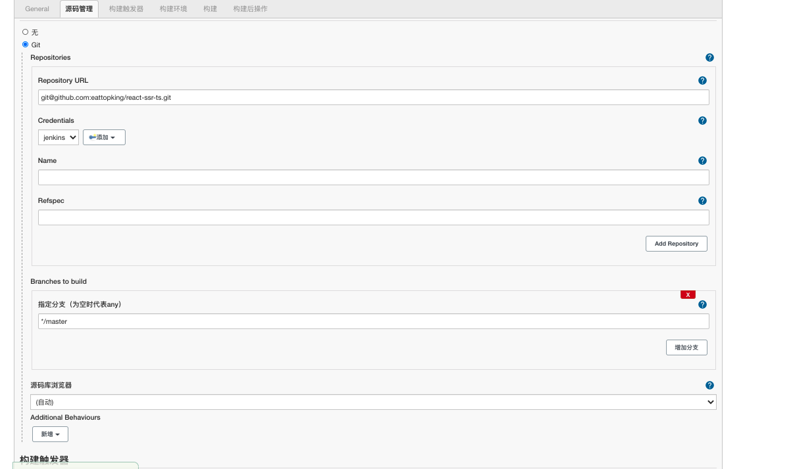
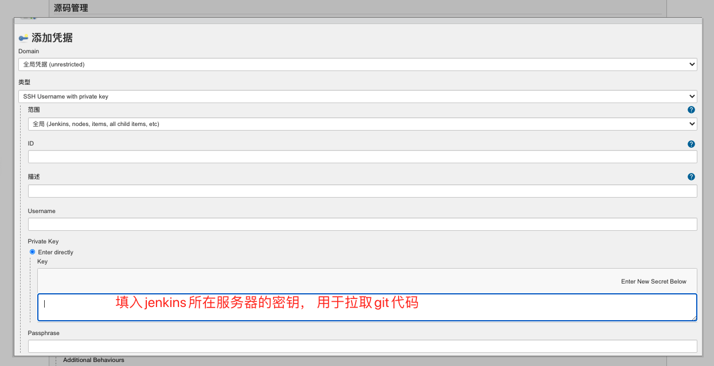
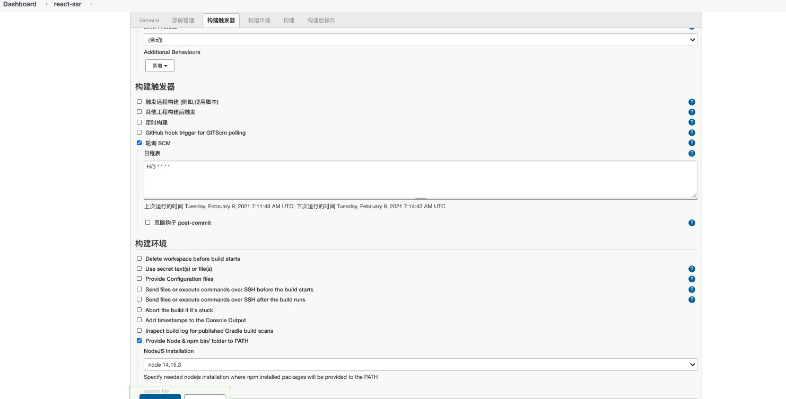
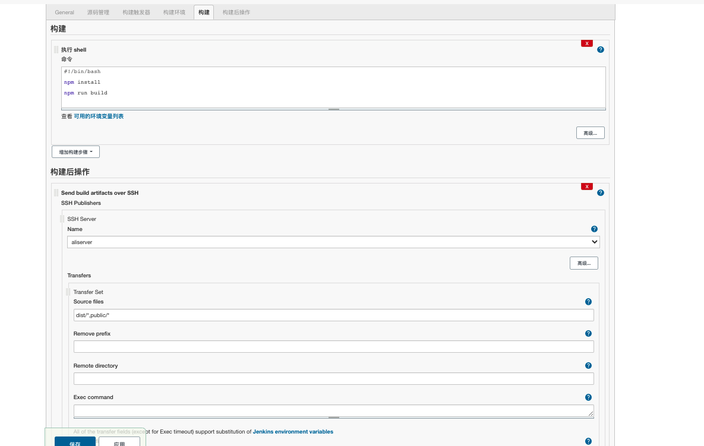
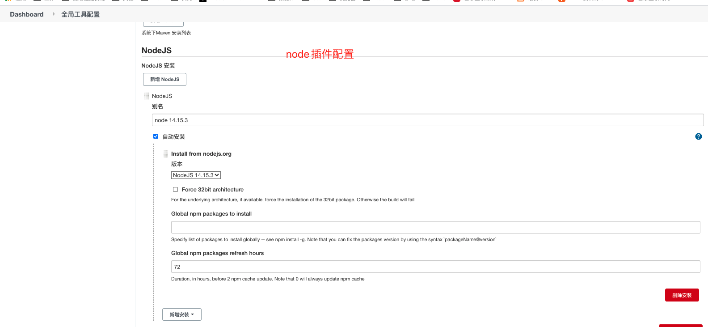
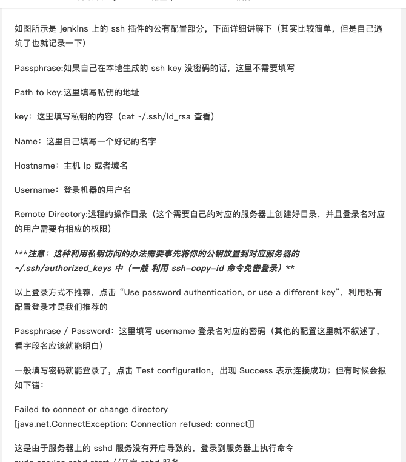

# Jenkins总结

1. Jenkins需要安装jdk(就是需要java环境)
2. Jenkins需要安装(使用docker的jenkins镜像完成jenkins搭建更加方便)
3. Jenkins需要安装插件(功能通过jenkins扩展)
4. Jenkins打包的时候需要的node环境，需要安装nodejs插件
5. Jenkins打包后需要将构建结果传递给前端服务器， 需要使用Publish Over SSH插件， 这里需要配置jenkins所在服务器的密钥(这个私钥只能rsa开头的，不能师openssh开头的)， 也要配置需要发布到远端的服务器密码
6. Jenkins所有的一切需要依据插件完成， 不能使用所在服务器的环境资源， jenkins会开辟一个空间存储和自己相关的资源， 和它所在的环境资源无关
7. 一个电脑可以生成多对公钥和私钥

# 使用docker 构建一个Jenkins前端发布 的过程

一. 首先安装docker

[docker安装教程](https://yeasy.gitbook.io/docker_practice/install)

二. 安装 Jenkins镜像
```
安装镜像默认从dockerHub安装， 就和node的npm是一样的
```

[docker安装镜像教程](https://yeasy.gitbook.io/docker_practice/image/pull)

三. 通过镜像创建一个Jenkins容器
```
1. 创建容器的方式可以通过docker命令行  docker run
2. 创建容器也可以通过， docker-compose， 通过执行配置文件的方式， 创建容器（这是真实场景中比较常见的应用）
```

[docker创建容器教程](https://yeasy.gitbook.io/docker_practice/container/run)

四. 对jenkins 进行配置， jenkins的主要功能都是通过插件扩展实现的

1. 基本配置



2. git插件配置





3. node插件配置



4. 构建配置



5. node插件引入配置



6. publish插件配置





