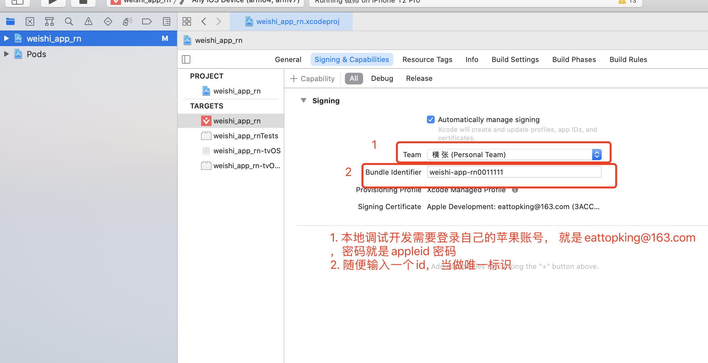
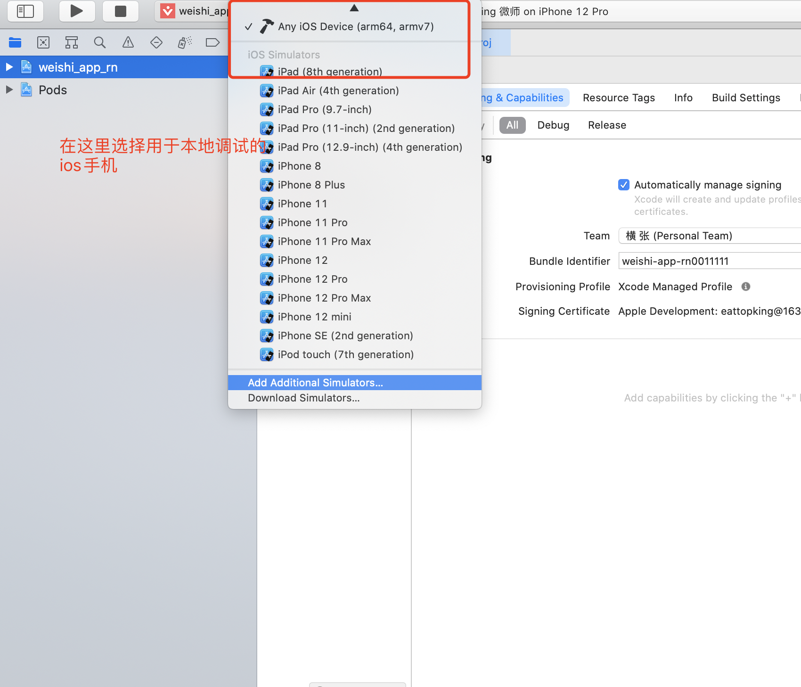
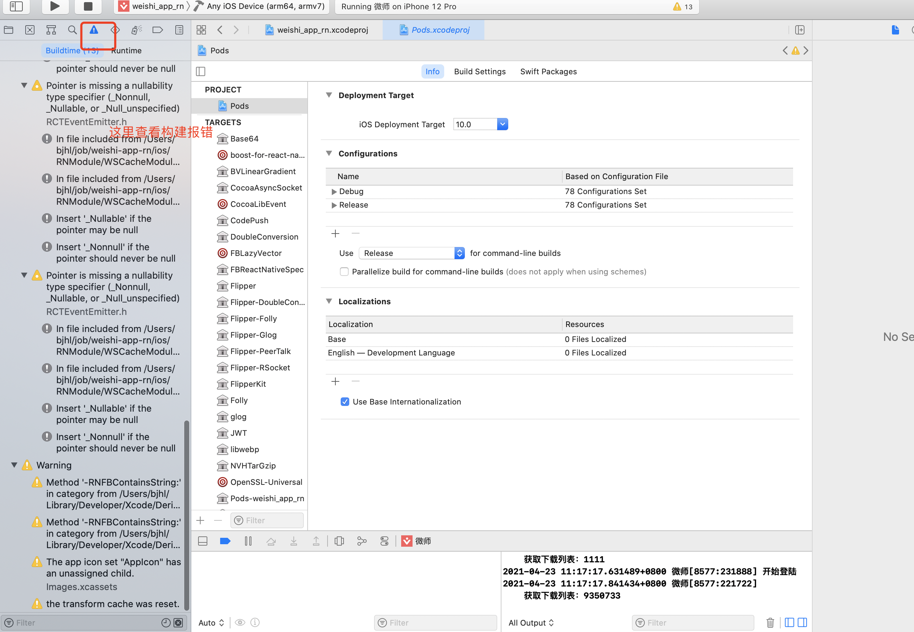
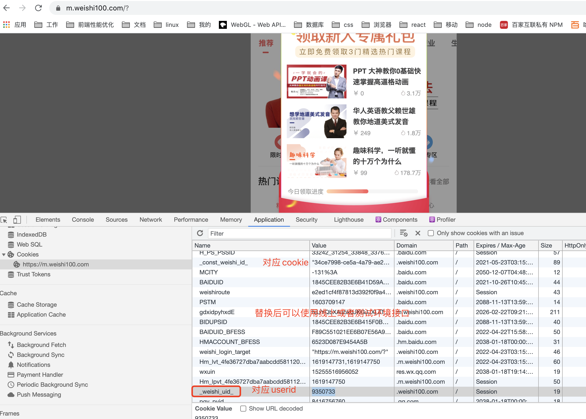
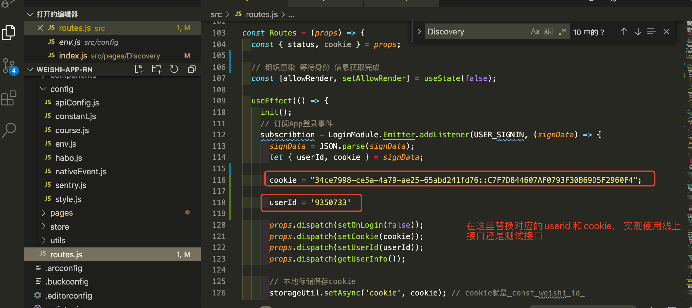
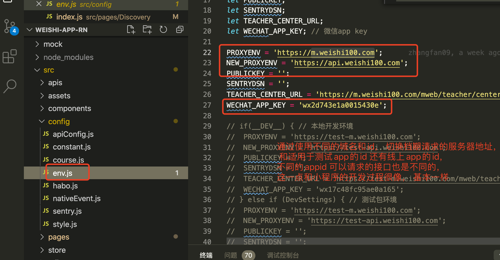
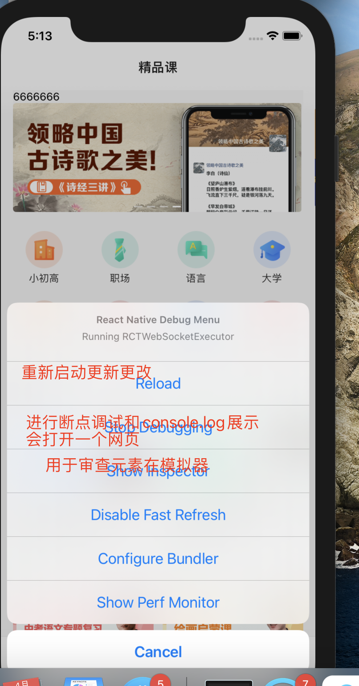

### react-native xcode 起项目 步骤

1. 在项目目录下, npm install 安装依赖

2. 切换到ios 目录下 pod install， 如果构建报错或者pod install 报错可以删除Podfile.lock, 多次pod install

3. 
4. 
5. 
6. 

7. 基本上在ios上开发就行， 只需要在用安卓环境比较是否有差异就行了

8. 开发的ios的时候只需要xcode 启动一次项目就行了， 就可以热更新监听react-native代码的更新， 并编译成最新的ios代码

9. 只需要开发完使用npm run build 打包一个生产环境的包， 别的时候不需要执行npm 指令

10. 
11. 
12. 

```
搭建环境


1.. ios项目pods的安装可能有问题， 需要在ios目录下手动pod install 重新安装


2. [!] No podspec found for `RNVectorIcons` in `../node_modules/react-native-vector-icons`  缺少图标依赖  ， 解决方式 yarn add react-native-vector-icons

3. 要先启动安卓模拟器， 才能启动安卓项目， 如果模拟器不自动启动的话

4. 安卓除了编译器还有很多jdk的版本需要符合

5. java 版本需要是11

6. 安卓启动报错 Error:Execution failed for task ':app:validateSigningDebug'. > Keystore file D:\Android_keystore\deb  解决方式： 把安卓staio里面把Store File里指定的Keystore文件的路径删除就可以了
```


### react native 调试

1. 

2. 审查元素时需要在模拟器上审查元素，然后查找对应的组件， 看看最后面的那个元素选中可以选中全部哪个就是我们要找的组件

3. debug 只能在console 中打印， 或者给react-native源码打断点， 不能查看网络请求

4. 在安卓和ios上都可以使用 yarn start 构建rn服务后， 在测试包的调试模式下配置起服务的电脑和端口（8081）， 这样测试包上就可以执行本地的业务代码了
[react-native ios 调试](./images/react-native16.jpeg)
[react-native ios 调试](./images/react-native17.png)

5. react-native 摇一摇那个调试页面，只有在rn构建后， 在xcode 和 安卓构建工具上只有构建debug包，才会展示rn内代码才会判断这个调试界面能展示出来，如果是正式包rn判断这个调试界面不会出来

6. 如果其它配置都没问题 ，但是摇一摇连接就是连接不上, 这个时候就按照报错上面展示的链接，在浏览器打开这个链接， 这个链接就是代理到我们手机的rn打包后的js文件，这个时候我们通过手机相机扫一扫这个页面在chrome上生成的二维码，之后就可以进行代理了， 然后我们在通过摇一摇重新连接一次
就好了
### 安卓发包流程


1. 在项目根目录下执行yarn build-android生成main.jsbundle和资源文件包assets

2. 将rn 项目生成的 main.jsbundle 文件替换掉原生项目中的main.jsbundle

3. 用第二步生成的/build/android中的其他所有文件夹替换掉 原生项目中/app/src/main/res中的同名文件夹

4. 根据需要打debug/release包，按照图示位置选择不同的打包方式：WeiShiDebug/WeiShiRelease
[react-native ios 调试](./images/react-native9.png)

5. 点击图一位置开始打包，然后会弹出图二所示弹框，选择APK，点击Next，在图三选择打包需要的签名文件（文件路径在原生项目的.keystore文件中），填写签名密码和keyAlias（在build.gradle中搜索storePassword和keyAlias可以看到具体值）。在图四选择包输出路径和打包环境（注意跟第五步对应），然后就能在指定路径输出apk安装包。debug和release安装包都可以直接上传蒲公英供下载。


[react-native ios 调试](./images/react-native10.png)
[react-native ios 调试](./images/react-native11.png)
[react-native ios 调试](./images/react-native12.png)

6. 最终要发布的包，出于安全考虑，需要利用工具进行加固+重签名，然后在 oms(就是内部的安装包管理平台) 上传。下载安装打开360加固助手，注册登录之后，如图一所示位置先添加签名（和第六步中图三一样的签名），然后将第六步生成的apk安装包拖动到指定位置等待加固和重签名。打开oms（就是内部的安装包管理平台），在图二位置填写相关内容，其中md5可以打开终端：md5 安装包路径  获取md5值（如图三所示）。之后点Submit，上传完成之后，在最终结果页点立即生效/立即更新， 安卓包发布完毕， 让pm发到各个应用商店

7. 报错解决 Cannot run program "node" /@react-native-community/cli-platform-android/native_modules.gradle'

解决方案：

open -a /Applications/Android\ Studio.app ./android/weishi-app-android

8.  java.io.IOException: Unable to tunnel through proxy. Proxy returns "HTTP/1.1 405 Method Not Allowed"

这是因为没有引用grade包，需要手动下载引入

[react-native ios 调试](./images/react-native13.png)
[react-native ios 调试](./images/react-native14.png)

9. ReactNative报'event2/event-config.h' file not found解决方案

查阅是因为Flipper-Folly版本导致的，将iOS文件下的 Podfile 文件做如下修改
use_flipper! 修改为 use_flipper!({ 'Flipper-Folly' => '2.3.0' })
改完后保存，将Podfile.lock文件删除，然后重新 pod install
installed完成后，返回上层目录执行 yarn ios (或react-native run-ios)就可以启动了

### ios 发布流程

xcode 构建注意
[react-native ios 调试](./images/react-native15.png)


### react-native 热更新

1. 只有是用react-native 写的代码，不包括新增和更新npm包， 并且不是针对之前的版本更新， 不是发新的版本， 那就可以使用热更新, 热更新需要有一个热更新的平台

2. react-native的热更新需要 在rn代码里引入react-native-code-push这个npm包， 并且配置， 安卓和ios的native端也需要进行配置

3. 然后在rn端编写shell 热更新脚本， 将热更新通过code-push将更新内容传到公司的热更新平台， 然后App杀死进程,重新进入app，就可以查看更新内容了

```
rn 配置如下

import CodePush from 'react-native-code-push';

const codePushOptions = {
  //设置检查更新的频率
  //ON_APP_RESUME APP恢复到前台的时候
  //ON_APP_START APP开启的时候
  //MANUAL 手动检查
  checkFrequency: CodePush.CheckFrequency.ON_APP_RESUME,
  //安装模式
  //ON_NEXT_RESUME 下次恢复到前台时
  //ON_NEXT_RESTART 下一次重启时
  //IMMEDIATE 马上更新
  installMode: CodePush.InstallMode.ON_NEXT_RESTART,
  minimumBackgroundDuration: 60 * 10,
};

//App 是我们的rn，入口组件
export default CodePush(codePushOptions)(App);
```

### 手机上的抓包工具

ios 手机、pad 上使用 stream 软件抓包

安卓手机上一般还是时候用charles

### 踩坑

1. 安卓手机上， 如果元素绝对定位超出了父元素的范围， 超出的子元素的点击事件就失效了，
解决方案就是给父元素写固定高度， 不让定位的元素超出父元素的范围

2. react-native App.js这个组件只有app启动初始化的时候才初始化一次, 其他的时候不会有任何的更新

3. 安卓打包勾选v1，V2导致打的报出现bug， 只勾选v2就没问题

4. 安卓加固后会把签名弄掉， 需要重新签名

5. 安卓包， 需要加固和签名才能用


常用依赖

    "@ant-design/react-native": "^4.0.5",
    解压缩的包
    "@自己要改/react-native-gzip": "^2.0.0",
    "@自己要改/react-native-smart-tip": "^2.2.6",
    下载资源的包
    "@自己要改/rn-fetch-blob": "^0.12.2",
    rn提供的组件
    "@react-native-community/art": "^1.2.0",
    "@react-native-community/async-storage": "^1.11.0",
    "@react-native-community/cameraroll": "^4.0.0",
    "@react-native-community/clipboard": "^1.5.1",
    "@react-native-community/cookies": "^4.0.1",
    "@react-native-community/image-editor": "^2.3.0",
    "@react-native-community/netinfo": "^5.9.5",
    "@react-native-community/picker": "^1.6.6",
    "@react-native-community/segmented-control": "^2.1.1",
    "@react-native-community/slider": "^3.0.3",
    "@react-native-community/viewpager": "^4.1.6",
    "@yz1311/react-native-http-cache": "^0.3.1",
    "axios": "^0.19.2",
    "babel-plugin-transform-remove-console": "^6.9.4",
    "moment": "^2.27.0",
    "ramda": "^0.27.1",
    "rc-form": "^2.4.12",
    "react": "16.13.1",
    "react-native": "0.63.2",
    // 热更新codepush、包
    "react-native-code-push": "^6.3.0",
    获取设备信息的包
    "react-native-device-info": "^8.1.2",
    // 快速渲染图片组件
    "react-native-fast-image": "^8.3.2",
    提供监听用户手机切换组件的组件
    "react-native-gesture-handler": "^1.8.0",
    // 渲染html标签字符串的的组件
    "react-native-htmlview": "^0.15.0",
    // 调起原生的拍照和图片选择组件
    "react-native-image-picker": "^3.2.1",
    过渡效果展示组件
    "react-native-linear-gradient": "^2.5.6",
    rn的md5加密
    "react-native-md5": "^1.0.0",
    rn的modal组件
    "react-native-modal": "^11.5.6",
    rn展示的进度条组件
    "react-native-progress": "^4.1.2",
    有用要安装上
    "react-native-reanimated": "^1.10.1",
    用于rn 在在兄弟元素外层添加元素， 类似于react-protals
    "react-native-root-siblings": "^4.1.0",
    用于rn路由跳转
    "react-native-router-flux": "^4.2.0",
    用于原生层释放未展示的页面，改善 app 内存使用
    "react-native-screens": "^2.9.0",
    rn sentry上报组件
    "react-native-sentry": "^0.43.2",
    rn 全局toast提醒组件
    "react-native-smart-tip": "^2.2.1",
    rn 轮播图组件
    "react-native-snap-carousel": "^3.9.1",
    rn播放音频组件
    "react-native-sound": "^0.11.0",
    rn使用tab切换组件
    "react-native-tab-view": "^2.15.0",
    rn 展示图标组件
    "react-native-vector-icons": "^7.0.0",
    // rn 播放视频组件
    "react-native-video": "^5.1.1",
    // rn 使用webview引入h5页面等
    "react-native-webview": "^11.0.3",
    // rn 调微信功能
    "react-native-wechat-lib": "^1.1.25",
    "react-redux": "^7.2.1",
    "redux": "^4.0.5",
    // redux 设置异步action，就是设置action可以使用函数
    "redux-thunk": "^2.3.0"


### rn 获取异常日志的方式

安卓的底层原理
Android 提供了一个异常捕获接口 Thread.UncaughtExceptionHandler 用于捕获未被处理的异常。

ios的底层原理
iOS 通常利用 NSSetUncaughtExceptionHandler 设置全部的异常处理器，当异常情况发生时，会执行其设置的异常处理器

然后基于安卓和Ios的原理实现的rn获取异常的npm包是 react-native-exception-handler,
就可以在rn设置对于多端的错误异常监听了


问题：

1. 为什么选择Rn

当时在调研的时候也看过flutter，了解到flutter确实在开发复杂的app的时候，比rn开发性能要好， 但是结合但是我们情况， 首先是当时项目要求能快速完成app的重构，并且团队中也没有熟悉flutter的伙伴，再有我们和其他团队的伙伴交流，其他团队有比较成熟的开发rn经验可以借鉴， 而且开发rn主要使用react， 比较好上手，在有就是rn的社区支持比较好，解决问题比较容易，所以结合这几点情况我们选择了rn

2. rn 如何实现的热更新
1. 全局安装code-push-cli,  注册code-push 账号

通过 code-push register 注册 code-push 账号, 注册账号的时候，会弹出一个页面, 选择github 进行授权注册, 关联github 的信息注册， 然后就注册成功了， 注册成功会返回一个key ，用这个key就可以登录code-push了，直接执行 code-push register 或者 code-push login 会直接弹出一个获取key的页面， 如果没有登录获取key页面或者是没有注册code-push直接弹出注册页面， 如果在code-push login 或者 code-push register 后面如果加上自定义链接 就是直接打开这个自定义链接的页面
内部实现是通过 childProcess.exec('start 自定义网页链接') 实现的打开浏览器页面

2. 在code-push中app,iso app 和 安卓app要分别添加，每个app添加完成后，都会有一个staging key （测试环境的key），还有一个production key （正式环境的key）

3. 在native端，将安卓app对应的测试环境的key和正式环境的key，配置到安卓的代码中，将ios app对应的测试环境的key和正式环境的key，配置到ios的代码中

<!-- ios就是在info.plist 文件中将codepushdeploymentkey的值根据环境设置为staging或者是production的热更新key， 安卓就是在mainapplocation.java文件中在new codepush创建实例时， 将deploymentkey的值根据环境设置为staging或者是production的热更新key -->

4. 在rn端， 安装react-native-code-push npm包， 然后在app.js文件中初始化热更新

可以在初始化的配置中设置什么时候检查更新，加载完更新代码之后，什么时候进行更新， 还可以手动检查检查更新， 并且热更新的时候还可以弹窗提示， 具体可以可以看看文档， 这些功能都是react-native-code-push 引用后的这个高阶组件提供的

5. 然后编写shell 脚本， 通过code-push release 上传热更新代码


<!--
首先通过 code-push login 登录code-push 管理后台获取到登录code-push平台的token，然后输入在终端输入token 登录code-push平台， 然后构建js bandle  推动代码到codepush 用于热更， 然后APP杀掉进程重启， 热更完成

2. 项目中安装react-native-code-push

3. 通过react-native-code-push，获取到的这个高阶组件包裹app.js这个这个入口组件，在代码上初始化热更新 -->

三. rn 如何引用native的方法, native端如何设置

ios端

1. 首先建立一个目录放我们的模块文件

2. 在目录中创建模块文件

3. 然后创建objective-c 类，然后  通过 RCT_EXPORT_MODULE 导出类

4. 然后通过 RCT_EXPORT_METHOD 导出 类中的方法

5. 通过constantsToExport 导出 类的常量属性

6. 最后在rn 代码通过 NativeModules 引入 原生代码中导出的模块 使用模块中的api和常量

.m 文件是定义的类的属性和方法是私有的，不能被外部访问的 .h文件定义的类的属性和方法是共有的， 可以被外部访问的


@interface 是声明 objective-c 类的

@implementation 是实现 objective-c类的

@interface 和 @implementation可以同时使用也可以单独使用

我们都是需要在xcode的参数配置文件 project.pbxproj 中从和node_modules平级的这个目录中的目录开始注册，最后将native端提供给rn的模块都注册，这样我们才能通过 rn 的NativeModules 获取 native提供模块， 然后在获取模块上的方法使用

安卓端

1. 首先在安卓项目的app/src/main/java/com 目录下新建一个目录专门放native端提供给rn 的模块，然后创建一个对应模块的java文件， 文件中创建一个 继承reactcontextbasejavaModule 的 java 类， 然后类中创建提供给rn的api

2. 创建好原生模块后需要将原生模块注册，否则js中无法引用到这个模块，需要再建立一个java 文件， 然后创建一个package类通过
这个package类的createnativeModules方法 添加原生模块， 实现注册

3. 然后我们在rn端还是通过 nativemodules 引用原生模块。


我们线上的安卓项目也是要有package.json 和 node_modules的， 真正的安卓工程不一定和package.json在相同目录，可以在比package.json所在目录深的目录 中

原生模块目录 com/aaa/bbb/原生模块.java
原生模块也是通过 模块中的 package com.aaa.bbb 导出模块的

在安卓studio中打开安卓项目直接打开真正的安卓工程所在的目录就行

安卓和ios 提供给rn的api 都是不能有具体的返回值的，返回值可以是promise， 其余的我理解就是void， 所以rn可以给原生api传回调函数来获取原生模块的返回值

四. react-native如何通过webview 和h5进行通信的呢

webView和h5通信就是以js的全局变量为媒介， 然后原生和h5的通过这个全局变量相互添加方法相互调用


五. native 如何获取使用 rn的方法

1. 在rn 端通过DeviceEventEmitter 注册事件和回调

2. 然后在native端触发这个事件，并给事件回调传递参数， 达到native 端调用rn方法的目的

在安卓端通过reactContext.getJsModule(DeviceEventManagerModule.RCTDeviceEventEmitter.class).emit('事件名称', 回调参数)  触发事件

六. 看那篇文章了解rn 原理

react-native 和native相比的优点

1. react-native 开发一套代码， 通过构建就可以构建成安卓代码和ios代码，提高了开发效率，降低了维护的成本

2. react-native 开发就是使用js 和 react 进行开发，对前端开发人员非常友好， 上手很快

3. react-native 内部引用的是原生的Api和原生的UI，确保了体验和性能。


react-native 通过内部实现的bridge实现rn和native的通信，react-native在Appregistry.registerComponent初始化的时候通过jsBridge获得原生内容,实现rn和native端的通信， 例如ios端就是使用RCTBridge 创建实例

正常的native和js的相互通信就是以js的全局对象为媒介， 在native端例如ios使用JSContext 创建一个js的全局上下文,这个全局上下文就是和js中的全局变量指向相同，native端在js全局上下文上添加原生方法， js就可以通过全局变量获取并调用， js在全局变量中添加方法， 然后native端就可以通过创建的js全局上下文获取到js添加的方法并调用,但是这样会导致js全局变量的污染, 但是现在的rn bridge也是使用这个原理在js 全局变量上添加native提供的模块实现native和js的通信

jsBridge 是通过native 代码实现的, 通过将全局对象作为媒介实现逻辑层和渲染层的通信, native端可以获取js的全局对象,实现了native端可以获取js全局对象上的方法进而可以操作js, 应用初始化的时候 bridge就将原生模块通过Json的形式传递给逻辑层, 然后挂载到js的全局对象上

rn通过 nativeModules获取native传递给rn的模块，ios底层使用nativeFlushQueueImmediate 获取native的模块， js获取native的模块逻辑, ios 是通过JSIExecuter将原生方法指向global.batchedBridge上边的js方法， 实现ios引用js方法


4. react-native使用虚拟dom 将react组件转换称为native原生组件

5. react-native 通过jsCore 引擎执行 main.jsbandle文件

6. react-native内部通过jsBrige实现js 和 native 的互相通信, jsbridge的作用就是js引擎提供原生的扩展， 让js代码可以引用原生方法, 就是在初始化的时候将原生的方法和模块打包成json格式给js引擎，准确的说是给messagequeue;

7. react-native 0.64版本ios也使用了最新的hermes引擎，hermes引擎提升了安卓端的性能， 缩短了启动时间， 减小了内存使用

8. react-native 和 native 的通信的异步的， 所以在进行大量实时交互的时候，会有一些性能问题， 比如大量的动画等， 但是我们的app不涉及大量的实时交互问题， 所以用起来没问题

七. rn 特有的东西， 比如 需要用 StyleSheet 设置样式， 需要用TouchableHighlight 包裹才能添加添加onPress 点击事件

等和web 不一样的开始要求

八. 我项目中有代表性的功能亮点， 说明白

目前就想到这么多， 想到接着看， 肯定有， 看完这些在查查


### react Native 架构原理

1. 通过Metro将react-native代码编译成jsbundle

2. 在hermes js引擎中执行jsbundle(逻辑线程, 逻辑线程也是在原生项目中的)

2.1 hermes 在0.64在ios中也被使用了, 原来只有在安卓中使用

2.2 hermes在安卓和ios打包的时候将js转换为hermes bytecode, 减小了jsbundle的体积, 从而减小整个APP包的大小

2.3 hermes的使用减小了安卓的首屏启动时间, 解决了内存占用的问题

2.4 hermes 执行hermes bytecode的速度很快, 直接执行js速度不如jsc和v8

2.5 js引擎是放在原生的包里的, 设置使用hermes引擎需要在原生代码中设置

2.6 rn0.64 版本中ios 支持使用hermes了, hermes中支持es6的proxy了

2.7 rn0.64版本中metro构建的时候支持构建处理jsbundle按需加载, 是rn代码按需加载不是原生模块按需加载

2.8 0.64 支持了react17

bridge特点:
2.9 异步通信
2.10 传递的数据是json, 需要序列化和反序列化, 这里也比较耗时
2.11 bridge 交互需要批量处理, 不是同步的

3. 将jsbundle中虚拟dom树传递给原生端(渲染线程)

3.1 通过jsi(jsi可以在js中直接获取原生模块)和bridge进行逻辑层和渲染的通信, 不使用json序列化和反序列化这个数据形式传递数据了

3.2 jsi(javascript interface通过C++实现, 可以让逻辑的js直接拿到原生渲染层的模块, 不需要通过bridge异步拿到了)


4. 在渲染线程将虚拟dom转换成shadow tree

5. 然后通过yoga 将shadow tree flex布局转换成原生布局, 渲染原生内容

6. 拆分rn, 这个已经完成, 将一些组件和api 拆分到react-native-community包中, 这个已经完成了


最新的rn架构和现在的架构不同点

1. fabric就是新架构中处理native渲染层渲染的, 并且通过fabric将native的模块导出为js对象, 可以让逻辑层中js引用, 逻辑层中也可以引用js中对象通过jsi

2. jsi 就是处理新架构中渲染和逻辑层通信的(jsi现在已经实现)

3. turbomodule 实现native模块的按需加载, 在初始化的时候只加载首页需要的native模块, 现在是全部native模块都加载

4. CodeGen 将ts转换为原生代码


rn应用启动流程

1. 启动app

2. 加载全部native模块

3. 加载执行jsbundle

4. 在逻辑层将虚拟dom传递给native渲染层后,将虚拟dom转换为shadow tree

6. yoga将shadow tree中的flex布局转换为原生布局

7. 渲染原生内容


优化: 

1. 使用图片懒加载优化首屏渲染

2. 


