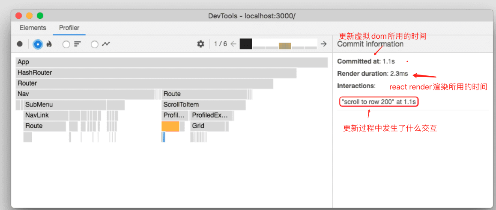

## hooks 总结

### react fabe 架构学习总结

### react 组件的性能检测和代码中的性能上报

react 中渲染让的含义： 渲染就是触发render， 然后进行render中新旧结果的比较， 得出比较结果

react 中提交（commit）的含义： 提交就是根据渲染得出的render差异，更新虚拟dom（但是没有更新真实的dom），
更新完虚拟dom会触发componentDidMount或componentDidUpdate生命周期

在react代码中的Profiler代码默认会在开发模式构建后被开启，在生产模式构建后被禁用， 我们也可以通过特殊的配置让我们在生产模式构建后的代码中依然可以实现Profiler的性能检测上报

[profiler代码在生产模式构建后依然可以使用的配置](https://gist.github.com/bvaughn/25e6233aeb1b4f0cdb8d8366e54a3977)

1. 在生产模式构建后被禁用的Profiler， 是指代码中的Profiler组件代码和chrome的react插件中的profiler录制都禁用

2. 在代码中加入Profiler组件本身就会影响性能

3. 在开发模式构建代码，通过亲身测试不能直接使用Profiler和profiler录制， 然后引入resolve: {
    alias: {
      'react-dom': 'react-dom/profiling',
      'scheduler/tracing': 'scheduler/tracing-profiling',
    }
  }
  还报错，不知道啥原因， 先记录到这里， 等要使用的时候在研究把

#### 在chrome浏览器中分析react组件性能

1. chrome中通过安装react插件，通过其中profiler（类似于chrome中的performance的录制）进行页面操作时的，组件提交的性能录制来分析react的性能

[profiler的具体使用教程](https://react.docschina.org/blog/2018/09/10/introducing-the-react-profiler.html)

2. profiler的性能分析就是以组件为单位(时间就是组件的虚拟dom更新时间)， 性能标准就是每次顶层和它子组件的渲染提交时间(虚拟dom更新时间)，每次提交可能顶层没有重新渲染， 所有是灰色， 只有顶层的子组件进行了渲染提交然后展示黄色等颜色，可以查看提交耗费的时间， 然后比较性能， 和选中后的组件的state和props可以根据切换提交来观察，不同提交的state和props的变化

#### 在组件中上报吗react的提交时间等性能

通过在在react实例中获取 unstable_Profiler 这个组件， 然后将组件改名为Profiler，然后将这个组件包裹在想监听的组件外边，
然后在Profiler的onRender事件回调中获取各种性能信息， 用于上报， 还必须给Profiler组件设置一个id， 用于区分不同的Profiler

### React 严格模式

通过过在react实例中获取StaticMode组件， 然后包裹在对应组件的外部， 实现对组件的严格模式检查， 如果出现不符合的， 会在控制台报出警告

严格模式会在webpack 开发模式构建后被开启， 会在webpack 生产模式构建被关闭

### redux的源码实现

首先redux有几个概念， store， reducer， action， store就是通过createStore 传入reducer创建出来的，
store 包含存放数据的state， 还有用于发送action的 dispatch， reducer 使用用于在dispatch 发送action的时候调用更新state 的， reducer是一个函数， 它的参数是action 和 当前的state

redux 还有中间件机制， 用于增强store的功能的， 主要是通过函数柯理化的原理实现的

react中要运用redux 要redux 和react-redux配合使用，react-redux提供两个组件一个是provider 组件用于包裹入口组件， 将redux的store 传给provider props上的store，用于从顶层传递数据， 还提供了connect 高阶组件，
用于组件注册redux数据的更新，然后返回一个新的组件， 然后在这新组件内部调用我们传入进去的组件， 然后将我们redux的数据通过props 传递给我们原有的组件实现在我们自己组件的内部接收redux数据的目的

connect和provider可以通信的原因是，react-redux内部是通过context传递数据的， connect和provider共用一个context实例， 所以它们两个数据是一个， 所以就可以将通过provider传递的数据，传递给被connect包裹的组件了

redux的使用还需要在看一遍

### create-react-app
创建的项目配置文件， webpack 配置会隐藏起来默认， 可以通过npm run eject 将隐藏的配置目录显示出来

### react 事件机制的实现

1. 首先我们react元素上注册的不是原生事件， 是合成事件， 因为我们react是虚拟dom， 我们注册事件的时候只是往fiber的props上加了属性， 还有不同浏览器之间在事件处理上有一些差异， 所以使用合成事件还有合成事件对象可以磨平不同浏览器的差异，通过react内部的判断

2. react的合成事件， 提供了顶层注册、事件收集、统一触发的事件机制

3. 顶层注册就是将真实的原始事件注册到root元素上，react17以后就是注册到root上了， 原来版本是注册到document上的， 注册到root上是因为，避免多版本react共存的时候， 发生事件系统冲突

4. 事件收集是指， 在通过目标元素触发root上注册的事件处理函数时，会根据目标元素向上查找，等到对应的事件执行路径数组，和对应的合成事件对象

5. 统一触发就是react 会在root上注册的事件处理函数中， 模拟原生事件的事件执行过程， 执行事件执行路径数组里边的事件处理函数

react 内部 会将相同类型事件捕获阶段执行的事件， 和冒泡阶段执行的事件按照顺序统一放在一个事件执行路径数组中，
当数组反向遍历的时候模拟捕获阶段， 正向遍历的时候模拟冒泡阶段， 我们的目标元素注册的事件是放在数组的第一位的

没有事件执行路径数组对应一个属于自己的合成事件对象， 但是这个数组是共用一个合成事件对象的， 阻止冒泡的模拟是通过调用阻止冒泡函数更改合成事件对象上的一个属性，通过在遍历数组的时候判断这个属性， 来结束循环实现阻止冒泡

事件是有优先级的：

优先级分为  连续事件（error） > 用户阻塞事件（scroll） > 离散时间（click）

不同优先级的事件， 在root上注册原生事件时使用的事件处理函数是不同的

在render 阶段 检测的到fiber的prop注册了事件， 这个时候就会往root上注册对应的原生事件, 如果react有对应的事件更新， 那就移除root上对应的原生事件，重新注册

react 根据事件名称判断事件触发的时机， 带有capture的事件就在捕获阶段执行

如果在父元素上注册了相同事件， 捕获和冒泡执行的两种情况， 这个时候事件收集阶段只会把和作为目标元素的子元素的相同触发阶段的事件收集

### createElement 源码理解

createElement接受三个或更多参数 createElement(type, config, children ,children),
除了前两个参数以外都是children, createElement内部会通过arguments 获取所有的children到一个数组， 然后把这个数组设置给传给这个组件的props.children属性

type 表示当前createElement创建的是什么react元素， 是类组件，函数组件，react 原生元素， react提供的例如Suspends这样的组件

config 就是父组件传给这个组件的props,然后组件内部筛选出这四个属性 __self, __source, key, ref, 然后其余属性作为props传给组件内部

createElement最后返回的就是一个对象， 返回的对象就是虚拟dom

这个对象包括 {
  // 这是表示这个元素是什么react 类型， 只要是jsx 都是REACT_ELEMENT_TYPE类型的
  $$typeof: REACT_ELEMENT_TYPE,
  // 我们给元素传的key
  key: key,
  // 我们给元素传的ref
  ref: ref,
  // 这个元素是什么类型的react元素
  type: type,
  // 筛选过后可以传给组件内部的props
  props: props
  //这个之后在了解
  __owner: owner
}

### Fiber 架构的理解

react fiber 架构的更新流程
render阶段
1. 触发react创建更新的操作的有三种分别是 ReactDom.render(),  setState, forceUpdate, 通过这三种方式触发更新,
创建更新内容update(记录更新相关信息), 将update存入到对应fiber的updateQueue中, 然后触发调度

1.1 ReactDom.render() 会创建一个fiberRoot, 存储在container上

1.2 FiberRoot对象
fiberRoot 是 reactDOM.render的第二个参数，这个dom对象上的一个属性

reactDom.render执行之后， 生成一个FiberRoot 对象，
这个对象 包括很多属性{
 containerInfo: rootDOM 这个属性存放的值， 就是reactDOM.render的第二个参数， 就是项目要挂载的根节点

 current: HostRoot 执行一次reactDom.render 创建的react应用的 fiber tree的根节点
}

HostRoot 
{
  child 就是reactDom.render第一个参数传入的这个react组件的fiber
  expirationTime 有更新时,当前hostRoot中优先级最高的任务的过期时间
  return : null , 只有HostRoot return是null,
  stateNode: FiberRoot
}

#### fiber对象
fiber是一个对象，主要结构就是

{
  return: 父节点

  child: 第一个子节点

  sibling: 右侧的兄弟节点

  updateQueue: 存储更新队列,
  expirationTime: 当前组件上优先级最高的任务的过期时间, 当组件没有更新的时候, expirationTime为null
}

fiber 查找节点的规则就是， 先找到自己的第一个子节点，如果自己点还有子节点就接着往下找， 找到没有子节点的了就看有没有兄弟节点， 如果兄弟节点有子节点接着找兄弟节点的子节点， 如果没有子节点就看看有没有兄弟节点，有兄弟节点接着找兄弟节点， 没有兄弟节点直接返回父节点， 在父节点按照这个规则继续查找

fiber 架构 就是根据fiber这个数据结构实现的，这个优化的架构, fiber 整体是一个树形结构

1.3 update的主要结果

{
  expirationTime: 过期更新时间
  payload: 要更新的内容，update更新不止是state更新，还可以是组件内容更新等
  tag: 更新的类型分为： 0(正常更新)，1(替换更新)，2(强制更新)，3（捕获错误的更新）四种
  next: 下一个update
}

updateQueue 是一个对象

{
  baseState: state, 最近更新完成的state
  firstUpdate: update,firstUpdate是一个单向链表记录这个组件所有的更新，我们所有的更新就记录在这上边
  lastUpdate: 链表上最后一个更新
}

1.4 expirationTime

在react的任务优先级中，异步的任务优先级是比较低的， 是可以被优先级更高的同步任务打断的，
但是为了防止异步任务一直被打断，导致异步任务无法被执行，所以每个异步任务根据优先级都会有一个过期更新时间（expirationTime），过了这个时间异步任务就会被强制执行了， 不能被打断了， 这是expirationTime的第一个作用

同步任务和指定context也有expirationTime（过期更新时间）

1.5 setState

1.5.1 setState就是创建一个update(更新)， 将这个更新添加到对应组件的Fiber的updateQueue对象中的存储更新链表的字段上，在render阶段结束的时候将state合并, 在commit 阶段批量更新state

1.5.2 内部执行了setState的函数, 会在react内部的batchedUpdates中被执行, batchedUpdates 函数中一开始会将全局变量isBatchingUpdates(默认值是false) 设置为true, 不能进行同步更新和异步调度更新了, 只有在 try {} 中将包含setState的函数执行完毕后,才能在finally{} 中将 isBatchingUpdates 设置为false, 然后将state进行同步更新

1.5.3 因为settimeout 和原生事件都属于异步, 所以会被加入异步队列, 在调用setState的时候回调不会被传入batchdUpdates中执行,
所以不会在一开始将isBatchingUpdates设置为true, 所有每次调用setstate都会触发同步更新, 还有就是isBatchingUpdates已经从true变为false了, 这个异步的回调中的setState才执行, 所以也是同步更新, isBatchingUpdates就是控制state批量更新的全局变量

1.5.4 所以说setState本身的执行是同步的, 只是react内部通过将包含setState的函数传入batchedUpdates中, 在执行之前将isBatchingUpdates更新true, 不能进行更新, 只有在包含setState的函数执行完毕后, 在将isBatchingUpdates设置为false, 然后统一更新state

2. 内部调用scheduleWork方法 处理调度, 给scheduleWork 方法传入当前更新组件的fiber和当前更新任务的expirationTime, 然后通过传入的fiber对象, 找到这个fiber对象对应的FiberRoot

2.1 通过判断当前fiber的expirationTime, 是不是没有过更新, 没有更新就将最新更新的expirationTime赋值给fiber的expirationTime, 最新更新的expirationTime和当前fiber.expirationTime比较, 如果最新更新的expirationTime更小,那就是优先级更高, 直接赋值给fiber.expirationTime

2.2 通过fiber的return属性, 逐级向上查找父级, 最终找到fiberRoot

2.3 新的更新任务优先级高于老的任务优先级, 老的任务正在执行时会被打断, 高优先级的任务会被先执行, 之前低优先级任务已经执行的部分会被还原, 调用resetStack中断, 将之前处理一部分的低优先级的任务还原, 只有isWorking是false或者iscommiting是true, 才可以继续更新,isWorking表示正在工作(包括render阶段和commit阶段), iscommiting 表示正在提交阶段(正在提交阶段就是将最终的fiber tree渲染到页面上, 提交阶段还可以继续触发render阶段的更新,互不影响)

3. requestWork 将发生更新的fiberRoot加入fiberRoot调度队列, fiberRoot调度队列是个链表, 然后判断是否可以进行批量更新, 通过isBatchingUpdates(如果是true就不可以批量更新) 还有isUnBatchingUpdates(如果是false就不可以进行批量更新), 如果可以进行批量更新, 是同步任务就执行, 是异步任务就开始异步调度

3.1 如果只有一个fiberRoot, 并且之前没有更新过, 那就将全局变量lastScheduledRoot, firstSchduledRoot都赋值为这个fiberRoot, lastScheduledRoot 表示fiberRoot调度队列中的最后一项, firstScheduledRoot表示fiberRoot调度队列的首项, 可以通过nextScheduledRoot继续向下查找fiberRoot, lastScheduledRoot是fiberRoot调度队列的最后一项, react内部通过这两个全局变量获取fiberRoot调度队列, 然后进行处理

3.2 每个fiberRoot上边都有nextScheduledRoot属性, 指向fiberRoot链表的下一项, 如果react应用中只有一个fiberRoot, 那么fiberRoot的nextScheduledRoot就是fiberRoot自身

3.3 在同一个fiberRoot再次触发更新的时候, 会将新一次更新的expirationTime和fiberRoot上之前的expirationTime做比较, 如果新的expirationTime更小, 说明新的更新优先级更高, 就将fiberRoot的expirationTime 替换成更小的这个, 优先执行优先级更高的任务, 更新都是从顶部向下更新的, 就是从fiberRoot开始向子级更新, 优先级高的任务执行的时候, 会将优先级低的任务执行一部分的结果重置

3.4 如果react中的更新都已处理完毕, 那就将lastScheduledRoot和firstScheduledRoot都设置为null, 最开始没有更新的时候
lastScheduledRoot和firstScheduledRoot也是null

3.5 处理更新的时候, 通过expirationTime的值区分任务的等级， 如果值是sync(同步任务)就会立即执行这个任务不会被打断，一直占用浏览器主线程到将任务处理完毕(处理完毕也是在render阶段), 如果是异步任务, expirationTime越小的优先级越高, 异步任务可以在render阶段可以中断

3.6 如果是异步任务，就进入调度流程，将异步任务放在requestIdlCallback(callback) 回调中， 等到浏览器空闲了再去执行这个异步任务，并且在执行异步任务的时候react会设置一个deadline(时间片)，如果超过deadline就会中断执行的异步任务，在注册一个requestIdlCallback(callback) 回调， 将没有执行完的异步任务，放在注册的回调中，等待下次浏览器空闲在执行，
当浏览器的空闲的时候，执行requestIdlCallback(callback) 回调的时候， 如果有异步任务的expirationTime 已经过期的话， 那就会将过期的任务都执行完， 直到执行到第一个没有过期的任务，执行行完过期任务之后如果时间没有超过deadline那就继续执行其他优先级高的异步任务，如果时间超过deadline ，那就将浏览器主线程控制权交给浏览器

3.7 这就是fiber架构的一部分， 任务优先级， 优先级高的任务先执行，提高性能， 避免浏览器主线程被优先级低的任务占用事件过长，导致页面性能下降, 从react16 开始有任务优先级的

4. react commit 阶段

4.1 将合并好的state批量更新

4.2 将最终处理好的fiber tree 进行页面渲染

4.3 执行Effect List中的副作用

4.3 执行生命周期函数

expirationTime 计算方式

requestIdleCallback  执行的时长

setState isBatchingUpdates  什么时候改变

expirationTime 如何比较

render 阶段同步任务直接执行, 怎么执行的

