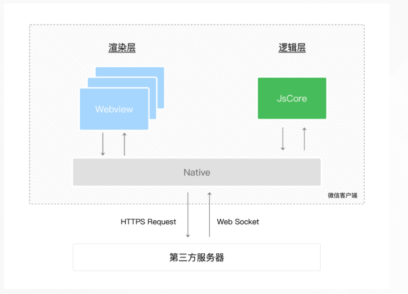

### taro微信小程总结经验

运行时就是在代码允许被运行的时候， 不是正在执行

1. 使用taro自定义开发小程序的tarbar， 更改选中状态的时候， 不能够通过重新tabbar初始话的router的来判断，而是必须在组件里面写死，
并且切换下一个的时候， 用类组件的时候需要获取自定义tabbar实例更新内部selected， 而使用hooks的时候， 需要使用redux控制， 否则一直会慢半拍，一直选中的都是上一个的, 不能再组件内部控制, 最好不要使用自定义tabbar性能会有问题

2. 每次切换自定义的tabbar， tabbar组件会初始化两次， 这个还没有查到原因

3. 一般需要设置一个开发环境的环境切换机制，  长按弹出切换界面， 此时需要使用自定义的navigationStyle

4. 在存储storage数据的时候， 要根据环境，添加上环境字段， 避免测试环境和线上环境，切换环境的时候， 出现storage数据混乱的情况，比如将测试环境的storage数据带到线上

5. 用户登录的时候， 后端将根据微信login 返回的code+session_Key生成的token设置成无限期， 然后前端只判断checkSession是否过期， 在token存在情况下, 需要使用wx.getsetting获取， 是否有各种权限， 没有的话，主要我们弹出获取权限页面， 如果需要手动触发的话， 不要手动触发的话，直接弹出获取权限弹窗

6. 小程序底部tabbar只能使用图片不能使用图标，小程序的自带tab不能使用网络图片， 只能使用项目里的图片

7. 学生提交的图片使用前端直穿oss的方式， 提高性能， 需要后端给提供直穿url， 并且使用post请求直传，
小程序有自己的上传的api

8. cors跨域携带cookie的是问题， 需要在ajax 中配置withCredentials为true， 让cors跨域的时候，能携带上cookie值， 这里需要注意， 跨域请求能携带的cookie值， 只能是cookie源为自己的请求域名， 或者为当前跨域请求的父级域名

9. taro中的全局事件， 比如分享， 需要在页面中配置才生效， 在组件中配置是无效的

10. 在页面切换到其他页面的时候， 当前页面会被储存在页面栈中， 再次返回页面的时候， 页面内的状态数据， 都会保存，并且taro， 回退页面的时候useEffectE不会执行， useDidShow会执行，所以当回退需要初始化的操作时， 需要在useDidShow中覆盖原有值

11. 小程序的特殊坑， 在组件文件中定义全局变量， 如果这个组件被共用使用，当组件被重复应用的时候， 组件的文件不会重新执行， 只会重新加载组件代码部分， 所有会有全局变量遗留上一次使用场景值的问题， 导致错误， 可以使用useRef 解决全局变量的问题

12. 小程序底部自带的tabbar 只要是加载了一次就一直在页面栈中了

13. 审核的坑， 添加一个类目， 第一次会进行二次审核时间比较长， 这个很坑

14. 小程序客服消息， 后台配置的坑， EncodingAESKey(消息加密密钥)配置的坑
[react-native ios 调试](./images/wxapp1.jpeg)

15. getUserInfo在用户没有授权的情况下，调用将直接抛错，不会再调起授权弹窗，在用户已授权的情况下可以获取用户信息
### 小程序的分享总结

1. 小程序分享时设置的路径什么， 分享进入的就是那个页面， 扫码进入小程序也是一样的逻辑
2. 所以在涉及登录的小程序中， 分享的话需要将分享路径设置为登录的中间页， 然后在中间页中根据参数，跳转到对应的页面

### 小程序的调试总结可以使用
1. 可以在开发者工具上， 自定义编译， 设置自定义编辑后需要进入的页面路径， 和进入页面后需要带的参数，还可以选择场景值，根据对应场景进入我们配的页面
2. 可以直接上传二维码图片, 模拟扫码进入小程序页面
3. 开发版本分享的内容， 需要对方用户的的小程序也是开发版本才能打开
4. 扫码目前只能开发对应部署的正式版本， 在开发者工具中也可以模拟扫描二维码的操作， 通过上传二维码图片

### 小程序运行环境



1. 小程序的页面展示在渲染层（渲染层依靠webview）， js 逻辑执行在逻辑层
2. 逻辑层和渲染层是相互独立没有耦合， 所以小程序的性能相对好一点
3. 逻辑层和渲染层的交互都是通过native端作为中介传递的， 逻辑层和服务器的交互也是通过native端作为中介传递的

## taro 使用总结

 ### 基本概念
 ```
 Taro 是一个开放式跨端跨框架解决方案，支持使用 React/Vue/Nerv 等框架来开发微信/京东/百度/支付宝/字节跳动/ QQ 小程序/H5 等应用
```
 ### 主要思想
 ```
 我们先了解一下taro的基本原理，在 Taro 中采用的是编译原理的思想，所谓编译原理，就是一个对输入的源代码进行语法分析，语法树构建，随后对语法树进行转换操作再解析生成目标代码的过程，基于编译原理，我们已经可以将 Taro 源码编译成不同端上可以运行的代码了， 内部依靠@tarojs/react：基于 react-reconciler 实现的小程序专用React 渲染器，相当于小程序版的react-dom，暴露的 API 也和react-dom保持一致，所以才能让我们使用react开发，  @tarojs/runtime： Taro 运行时,  为了Taro内部提供基础方法， 并在小程序端模仿浏览器实现了，window、navigator、document、Date等对象，并通过 Webpack 的 ProvidePlugin 注入到项目的全局对象
```

### Taro的两个利器
```
1. @tarojs/components ： taro只能使用跨平台组件， 如View、Text组件， 他们都来自@tarojs/components 这个库

2. @tarojs/taro :  给开发者暴露Taro 的 封装的集成多端的API

3、taro中可以完全使用react语法， 可以使用类组件也可以使用hooks
```
### 注意事项
```
1. 需要注意的地方就是project.config.json 中，“miniprogramRoot”: “dist/”,就是小程序源代码的路径一开始可能是错的，在项目之后可能会报错，所以我们需要检查一下， 有错误需要更改一下

2. 在项目搭建的时候， 我们可以选择我们的css预处理器，然后在开发中和开发web的用法相同

3. 在taro中也可以引入自定义图标， 也是和web中引入的方式相同

4. 样式单位直接用px就行， taro内部做了转换
```

### taro 自定义设置

1. 自定义项目模板， 在文档中社区生态, 项目模板模块有详细介绍

### 小程序页面栈和路由的理解

1. 小程序不是刚进小程序就必须进入tabbar页面的

2. redirectTo 跳转关闭当前页面， 是可以关闭tabbar页面的，如果当前页面是可以返回的的，那redirectTo跳转后的页面会继承这个属性， 可以返回当前应该返回的页面中

3. relaunch 关闭全部页面， 包括tab页面

4. switchTo 跳转tabbar页面的同时会关闭其他非tabbar页面, 无论是切换tabbar按钮和通过switchTo切换tabbar页面， 都不会将tabbar页面重复加入页面栈，tabbar页面进入页面栈如果不手动
移除页面栈，比如通过redirectTo， relaunch， 否则tabbar页面进入页面栈就不在出栈了， tabbar 页面在页面栈的顺序按照进入页面的的顺序排列， tabbar页面和其他页面都在一个页面栈中， 按照进入的顺序排列

5. navigateTo 跳转页面会保留当前页面在页面栈中， 只可以通过navigateBack 返回navigateTo跳转的页面

6. 在当前页面，通过navigateTo 跳转到其他页面吗或者正在展示当前页面， 当前页面都在页面栈中

7. 页面栈最多十层

8. 在当前页面通过navigateTo 跳转自身， 也是可以的， 就是将这个页面再一次push进页面栈中了，就是一个重新初始化的新页面了， 这个逻辑小程序和app 是一样的

9. 在当前页面多次点击跳转其他页面，导致相同的navigateTo 跳转， 会将相同的页面多次加入到页面栈

问题：

1. 为什么选择taro

1. 小程序的逻辑层是运行在jscore中的，没有提供浏览器中的dom api 和bom api， 所以原生小程出开发中无法使用 相关的api和相关的一些包，还有原生小程序的开发和我们正常前端开发方式也有不同， 也需要一定的上手时间， 原生的开发效率也不高

2. taro 是使用react 语法的，符合前端的开发习惯， 上手快，开发效率快， taro还实现了浏览器的bom 和dom api， 所有原生小程序不能用的包，taro基本都可以使用

3. 还有这个项目之前， 我就了解过taro， 因为是使用react 语法开发小程序， 所以我也写过demo， 把整个开发流程也都跑通了, 也算是有一些经验

4. taro 和其他框架之间，选择taro的原因是因为我们整体的技术栈就是react，我们想要保证技术栈的统一

5. 所以结合这些原因我们选择了taro


2. taro 的原理和实现

1. 使用react-reconciler 根据不同的宿主环境创建了react 渲染器, 构建出不同宿主环境支持的
元素

react-reconciler是负责将react 转换到小程序的视图层


2. 通过taro/runtime taro 运行时， 提供 createReactApp， createPageConfig ， 以小程序为例， 将react的生命周期转换为小程序的生命周期， 完成小程序的注册， 和小程序页面的注册

taro/runtime是负责将react 转换到小程序的逻辑层

react-reconciler 的使用

import ReactReconciler from "react-reconciler";

let reconciler = ReactReconciler({
  /* configuration for how to talk to the host environment */
  /* aka "host config" */

  supportsMutation: true,
  这个函数是通过判断虚拟的type 转换对应宿主环境的元素的
  createInstance(
    type,
    props,
    rootContainerInstance,
    hostContext,
    internalInstanceHandle
  ) {}
})

whatToRender 表示虚拟dom

div表示对应宿主环境的容器

export default {
  render(whatToRender, div) {
    let container = reconciler.createContainer(div, false, false);
    reconciler.updateContainer(whatToRender, container, null, null);
}


3. 小程序 的通信原理， 如何渲染分层, 如何native 端通信的
小程序 ios的引擎是jscore， 安卓的是v8， ios的视图层是有wkwebview渲染的， 安卓的视图层是由xweb渲染的

4. 小程序热更新
通过wx.getUpdateManager 获取更新实例， 注册检查更新和完成更新下载的事件， 然后准备开始更新，调用manager的applyupdate的方法
进行更新, 正常情况下都是在冷启动检查更新， 冷启动引用更新
5. 小程序登录
通过login 方法获取到code等信息 和通过getuesrProfile获取到的用户信息， 传递给后端实现登录， 然后后端登录成功之后， 返回给前端一个token， 这个token永久有效， 然后每次打开小程序都要通过checkSession检查小程序的是否过期， 如果过期了就重新获取code等， 进行登录
6. 小程序分包机制和限制
分为主包和其他包的大小不能超过2M
7. 有哪些优化
分包
8. 有哪些坑

9. 小程序的原理
小程序分为逻辑层，和视图层， 两个层互不影响， 所以性能相对高， 因为js 执行不影响渲染,
逻辑层和视图层分别由两个线程管理，一个页面都需要一个视图层线程， 所以多个页面就有多个视图层线程，视图层和视图疼， 还有和逻辑层， 都是通过jsbridge，在native端处理通信的，
10. jsbridge 到底是个啥
jsbridge就是将native端的方法和模块注入到js引擎中，让js引用

后面肯定还有， 到时候搜搜想想，再加上


### 小程序性能优化相关
小程序的性能检测和完整的分包优化, 和其他优化策略在小程序文档中有一些比较完整的记载


